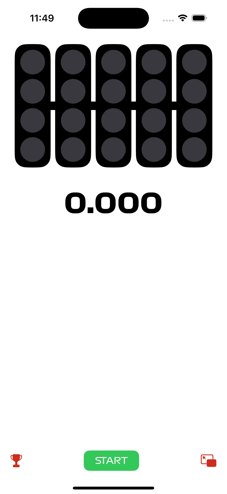
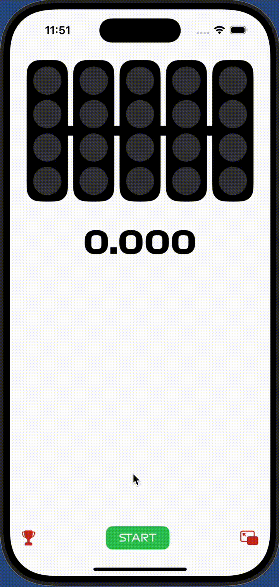
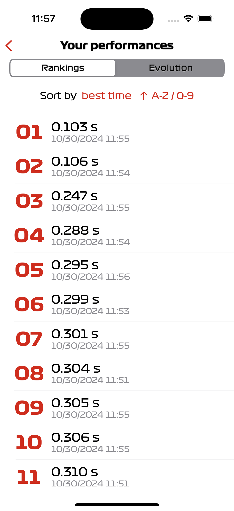
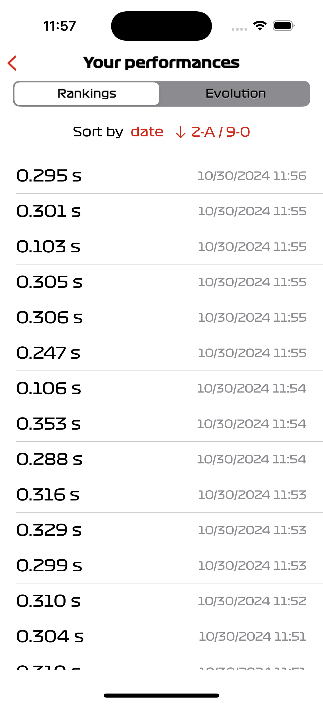
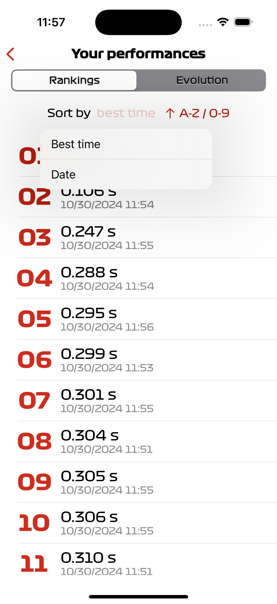
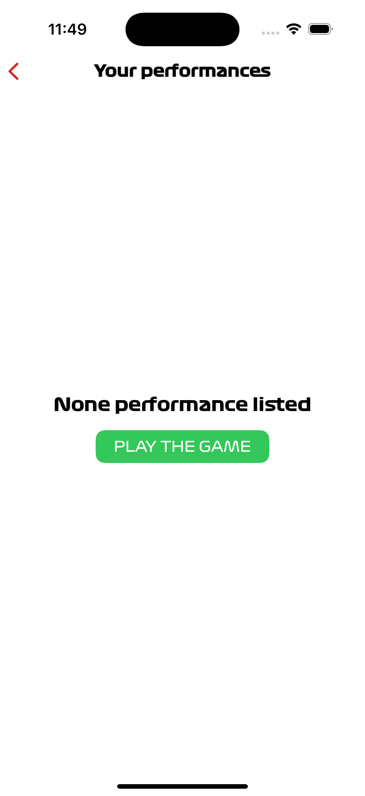
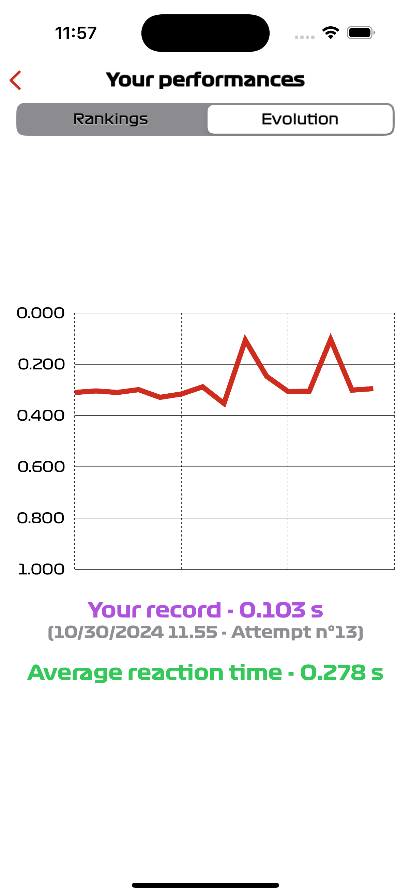

# F1 Race Start Simulator
Mobile application about reflexes test (as some F1 and MotoGP athletes already [played](https://www.youtube.com/watch?v=BhLr43elNCE)). 
This app is about a game simulation with a reaction time, all based on the starting conditions of an F1 race.
It's based on [this web application](https://f1-start.glitch.me/).

## 📝 Table of Contents
- [Languages](#-languages)
- [📱 Gameplay & screenshots](#-gameplay--screenshots)
    - [Game view](#1-game-view)
        - [Use cases](#use-cases-)
    - [Performances views](#2-performances-views)

##  Languages
The app is available in the following languages :
<ul style="display: grid; list-style: none; grid-template-columns: repeat(3, 1fr);">
    <li>🇬🇧 English</li>
    <li>🇫🇷 French</li>
    <li>🇪🇸 Spanish</li>
    <li>🇩🇪 German</li>
    <li>🇵🇹 Portuguese</li>
    <li>🇳🇱 Dutch</li>
</ul>

## 📱 Gameplay & screenshots
### 1. Game view

    
    

        In this view, the user can play the game by tapping on the "START" button. The five lights will turn on one by one and the user has to tap anywhere in the empty zone when the lights turn off to start. If the user taps too early, he will have to restart again.
          
        Finally, the user will see his performance (should be broken) and can choose to play again or to go back to the performances view.
          
        As far as the other buttons are concerned, the one at the bottom left is for showing all the user's performances and the one at the bottom right is for exiting the application.
    

#### Use cases :
|                                                 Normal start                                                  |                                                       Jump start                                                       |
|:-------------------------------------------------------------------------------------------------------------:|:----------------------------------------------------------------------------------------------------------------------:|
|  |  |

### 2. Performances views
#### Lists

    
    
    

In this view, the user has access to all the reaction times taken since installing the application.
It's possible to sort this data in order (ascending or descending) of reaction time or the date on which the reaction time was established.
To do this, simply click on the buttons representing the filters.

    
    
If no reaction time has been set, this view asks the user to play with the simulator at least once.

#### Evolution of performance

    
    
It's also possible to view the evolution of reaction times established to date. The user's average and best reaction times are also shown.

